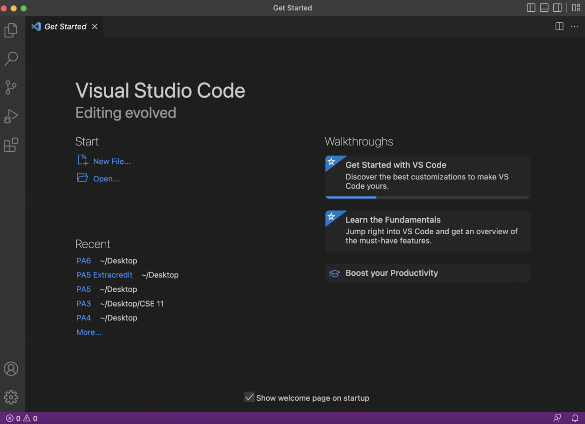

# Lab Report 1
To log into a course-specific ieng6 account, there are multiple steps that must be followed carefully. Since this requires the use of your course-specific account, it is important that you are familiar with your course-specific username. This can be looked up easily at the following link:

[Link](https://sdacs.ucsd.edu/~icc/index.php)

Once you enter your PID and username, you will be redirected to an Account Lookup Results page where you will find your course-specific account under Additional Accounts. It is also important to know your password and make sure to reset your password upon first use by clicking on your course-specific account under Additional Accounts and using the Global Password Change tool to reset it, following the on-screen instructions thenceforth. Once you have your account and password ready, it is time for you to access the computer servers remotely!

## Step 1: Installing VSCode

VScode is an IDE that you will use to access the terminal, and can be downloaded at the following link: 

[Link](https://code.visualstudio.com/)

Since I already had VScode installed for use in previous courses, I did not need to install it. However, once you have it installed, this is what it should like:

This is what it would look like if the default startup welcome page is visible. If you click on the X button in the top left corner next to where it says “Get Started”, you should see this:

Congrats! You can now move on to the next step. 

## Step 2: Remotely Connecting 

To remotely connect, you should first open a terminal window. This is done through the menu bar by clicking on Terminal → New Terminal or using the keyboard shortcut as seen below:

This will launch a terminal window inside VSCode that will usually pop up at the bottom of the screen, and whose size can be changed by dragging the window up. Once the terminal window is open it should look like this:

You are now ready to connect to the remote server. Since I am using a Mac, the following steps are for Mac users. First, you need to use ssh to remotely access the server. The command that you will type in first is: 

`$ ssh cs15lsp23zz@ieng6.ucsd.edu`

The $ is used to indicate that what follows it is a command, and you should not include it when you type in. Also, you must replace the “zz” with the letters that are unique to your course-specific account that you looked up. Once you type in the command with the correct letters, press enter and you should see the below prompt:

As you see, it asked if you are sure you want to continue connecting, and so to be able to access this server, type yes. You will then be prompted with a message that informs you that ieng6.ucsd.edu has been added to your list of known hosts. 

Next, you just need to type in your password and press enter. 

*Note that while you are typing in your password it might look like you are not really typing anything since the password will not be visible, but do not worry as it is being typed.* 

Once you correctly enter your password, you will see the below prompt indicating that you have successfully logged into the remote server:

You now have remote access to the CSE lab computers, and are ready to move on to the next step!

## Step 3: Trying Some Commands

There are many commands that you can now try and experiment with, testing them out to see what outputs you will get and attempting to understand the differences between them. 

These commands include `cd`, `pwd`, `ls`, `cp` and `mkdir`. 

These commands can also be added on to, such as `cd ~`, `ls -lat`, `ls -a` and more. 

Once you type them in, you will see different outputs, as seen in the below examples:

---

1. `ls -lat` and `ls - a`

Here, for example, ls stands for list and will list the contents of a directory. 

The different additions also accomplish different outputs. 

For instance, in ls -lat, the -l stands for long-listing format, the -a for all entries and -t for time modification sorting. Below it, the -a alone just prints all entries in no specific format or sorting. 

This is just one example of how you can experiment with the commands, which is by looking at the different outputs and attempting to figure out the difference. 

2. `pwd` 

This is a simple example that just prints out the path for the current directory, as seen below:

---

Keep going! Try out different commands, try combining commands, and see what happens! 

Once you have done that, you can now log out by simply pressing: CTRL-D or typing the command 'exit', and you should see the below prompt indicating that you no longer have remote access:

