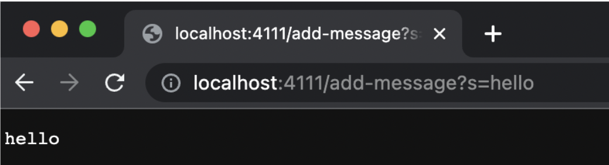
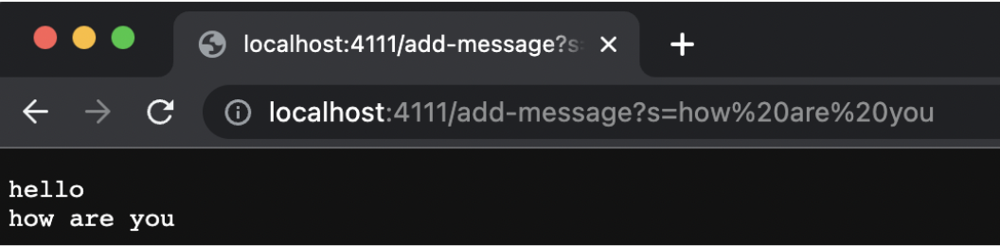

# Lab Report 2

## Part 1
Writing a web server that handles a URL request requires multiple steps. First, it is important to check the URL path for specific key words so that the program understands when to complete a certain function. In this example, the StringServer program looks for the specific keyword “/add-message”, and using .split, then stores the String that the user types in after the equals sign. It then adds that String to the stored String that includes all the previous Strings, and as a result is able to concatenate them and print them subsequently, as seen below. 

*Code:*

`  
import java.io.IOException;
import java.net.URI;

class Handler implements URLHandler {
    String stored = "";
    
    public String handleRequest(URI url) {
        if (url.getPath().contains("/add-message")) {
                String[] parameters = url.getQuery().split("=");
                stored = stored + String.format(parameters[1] + "\n");
                return stored;
            }
        else{
            return "404 Not Found!";
        }
    }
}

class StringServer {
    public static void main(String[] args) throws IOException {
        if(args.length == 0){
            System.out.println("Missing port number! Try any number between 1024 to 49151");
            return;
        }

        int port = Integer.parseInt(args[0]);
        Server.start(port, new Handler());
    }
}
`

*Compiling and running the program in the terminal, and ensuring that a unique port number is used:*
`
ziadbanany@Ziads-MacBook-Air StringServer % javac Server.java StringServer.java 
ziadbanany@Ziads-MacBook-Air StringServer % java StringServer 4111
Server Started! Visit http://localhost:4111 to visit.
`

*Below are screenshots of adding different Strings to the URL, which are then concatenated and printed out in succession, followed by a brief description for each:* 

