# Lab Report 4

The following steps are aimned at performing tasks that clone an existing repository, use Vim to edit files, run tests, commit and push all from the command line. 
Prior to the following steps, a repository was forked on Github. Below each step is an outline of the exact keys pressed, screenshots of the terminal and summary of the commands. 

## Step 1: Log into ieng6 

*Keys Pressed:* `ssh<space>cs15lsp23dy<⇧2>ieng6.ucsd.edu<enter>`

*Summary:* This logs into the remote ieng6 server,`⇧2` were the keys pressed for the @. 

*Screenshot:*
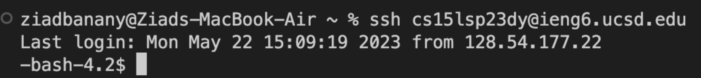

## Step 2: Clone the fork of the repository from your Github Account

*Keys Pressed:*  `git<space>clone<space>https<⇧;>//github.com/zelbananyucsd/lab7fork<enter>`

*Summary:* This uses the git clone command to clone the forked repository from the Github account, `⇧;` refers to the use of a colon. 

*Screenshot:*
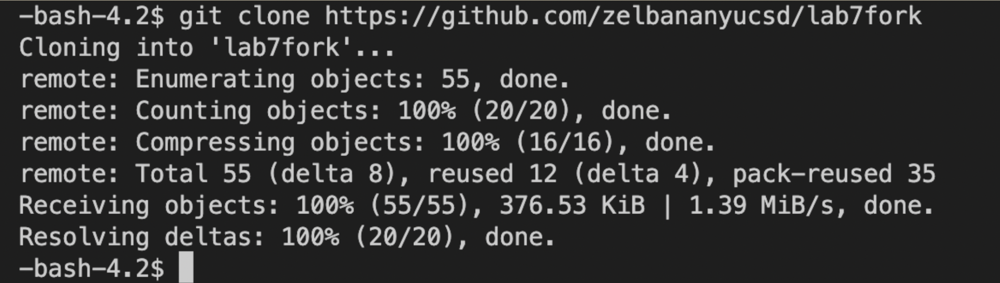

## Step 3: Run the tests, demonstrating that they fail. 

*Keys Pressed:* `ls <enter>`,`cd<space>lab7fork <enter>`,`javac<space>-cp<space>.<⇧;>lib/hamcrest-core-1.3.jar<⇧;>lib/junit-4.13.2.jar<space><⇧8>.java`,`java<space>-cp<space>.<⇧;>lib/hamcrest-core-1.3.jar<⇧;>lib/junit-4.13.2.jar<space>org.<⇧j><⇧u>nit<⇧c>ore<space><⇧l>ist<⇧e>xamples<⇧t>ests <enter> `

*Summary:* First this uses the `ls` command to list the files/directorty in the directory and then uses the `cd` command to enter the forked directory. I then enter the commands for running the JUnitTest with the occasional `⇧` to indicate an uppercase letter. This shows that one test failed, which will be fixed once we use Vim to edit the file. 

*Screenshot:*
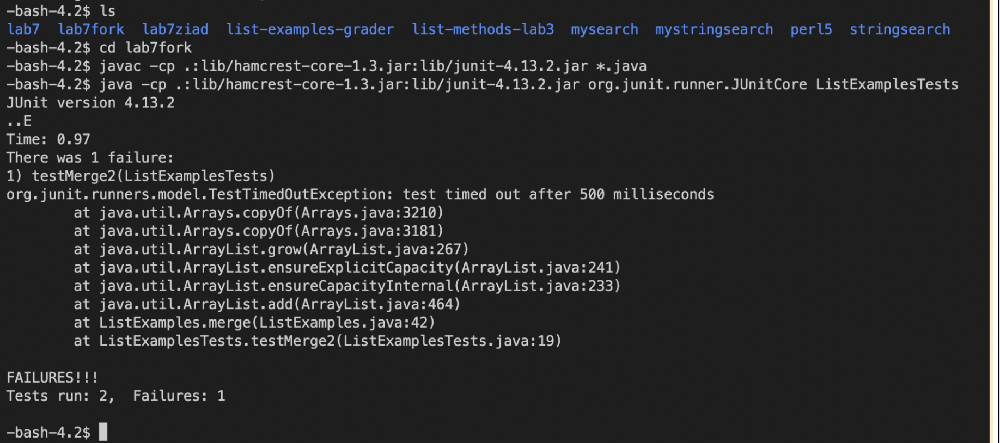

## Step 4: Edit the code file to fix the test

For this example, since editing in Vim requires multiple steps and each step looks different, a screenshot will be provided after every individual command. 

*Overall Keys Pressed:* `vim<space><⇧l>ist<⇧e>xamples.java <enter>`,`/test,<enter>`,`<down>`,`<left><left><left><left><left><left>`,`x`,`i`,`2`,`<esc>`,`:wq<enter>`.

*Individual Screenshots and Their Summaries*:
1. `vim<space><⇧l>ist<⇧e>xamples.java <enter>`
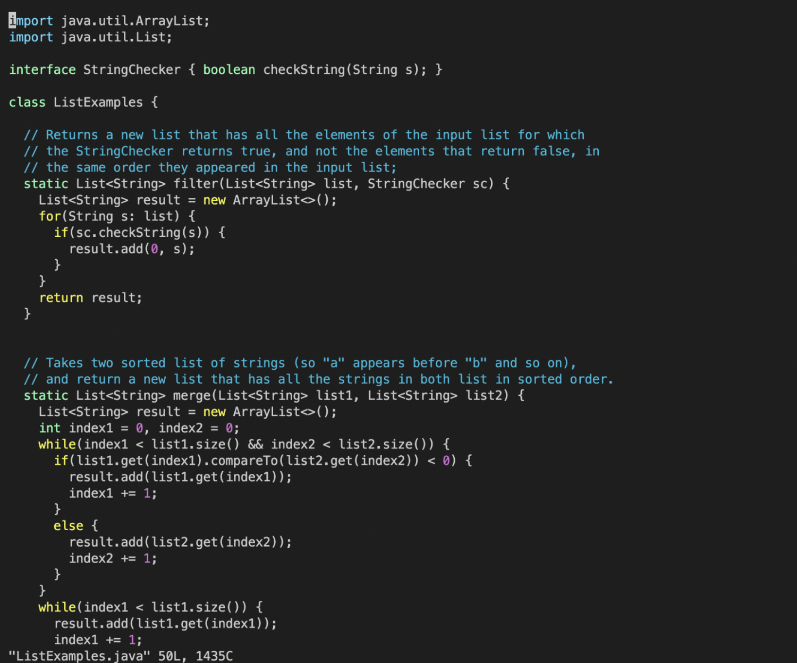
This opens up the ListExamples.java file in Vim. 

2. `/test, <enter>`
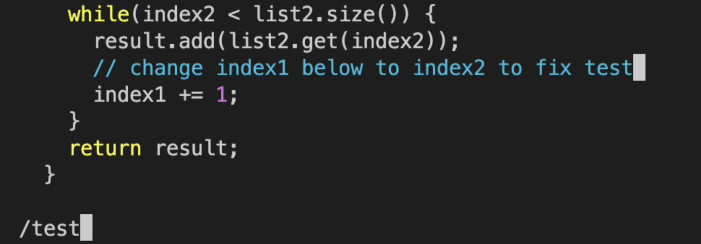
This uses `/` which is the Vim command for searching and then searches for the keyword "test" as a shortcut to get to the part of the code that needs to be fixed.

3. `<down>,<left><left><left><left><left><left>`
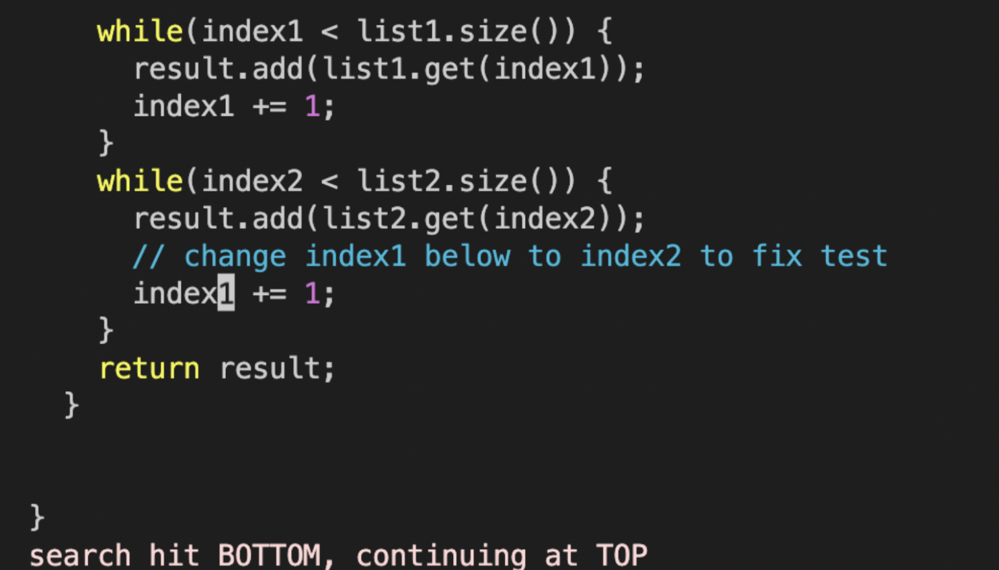

This uses the arrow keys to get to the exact character '1' that needs to be replaced. 

6. `x, i, 2, <esc>`
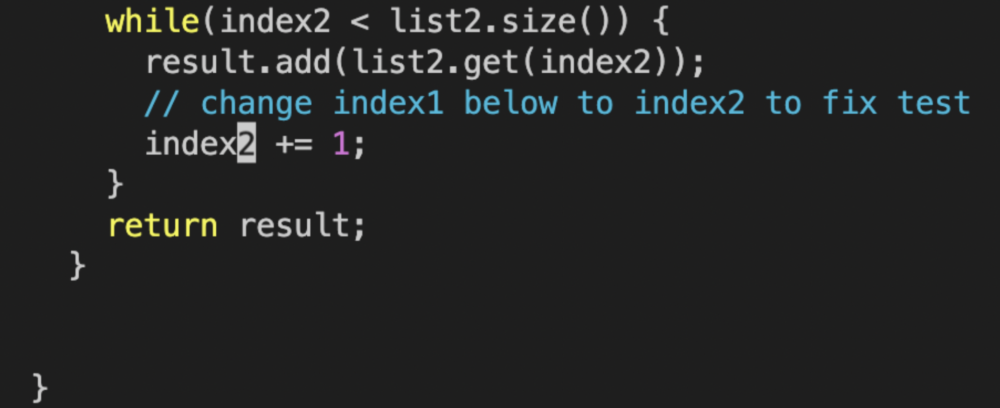

This uses the command `x` which is the Vim command for deleting a character, then uses the commabnd `i` which puts Vim into insert mode, and then types in `2` which is then character that replaces the deleted character, and finally escapes Vim using `<esc>`.

10. `:wq<enter>`
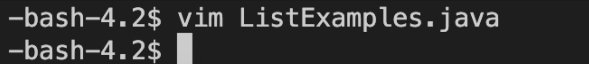

This uses `:wq` which tells Vim to save first (`w`) then quit (`q`) thus saving the changes made to the file. 

## Step 5: Run the tests, demonstrating that they now succeed

*Keys Pressed:* `<up><up><up><enter>,<up><up><up><enter>`

*Summary:* The up arrows were used to go back 3 commands in the search history and find the command that compiles the java files instead of having to rewrite the long command. Then, another three up arrows were used to find the command that runs the program's JUnitTests

*Screenshot*: 
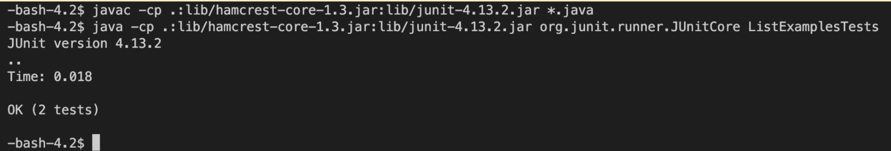

## Step 6: Commit and push the resulting change to your Github account

*Keys Pressed*: `git<space>add<space><⇧l>ist<⇧e>xamples.java <enter>` , `git<space>commit<space>-m<space>"updated<space><⇧l>ist<⇧e>xamples <enter>`, `git<space>remote<space>add<space>origin<space>git<⇧2>github.com<⇧;>zelbananyucsd/lab7pushed.git <enter>` , `git<space>branch<space>-<⇧m> <space>main`, `git<space>push<space>-u<space>origin<space>main`   

*Summary:*
This first uses git add to add the updated file, then git commit commits it to the main branch with a unique message, then I followed the steps necessary to add an existing repository and push it to a new one.

*Screenshots:*
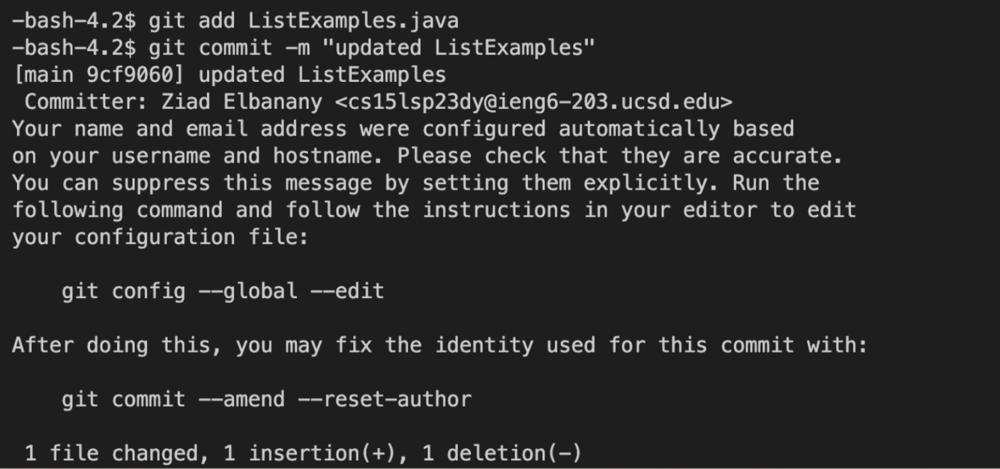
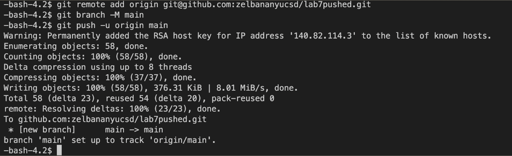

