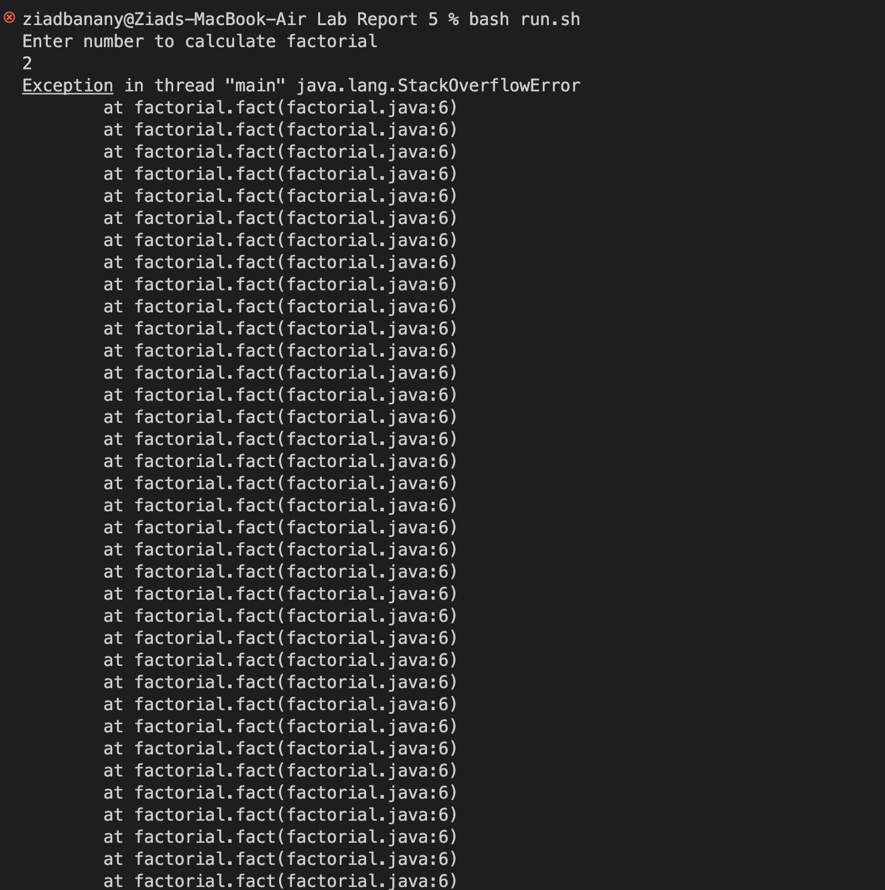
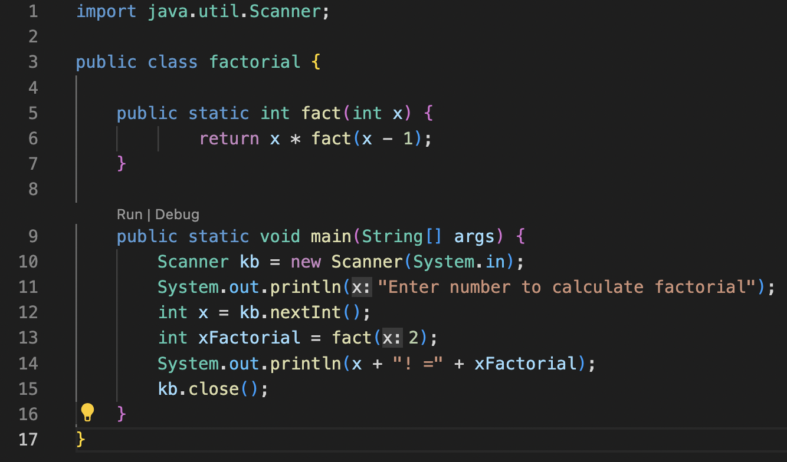
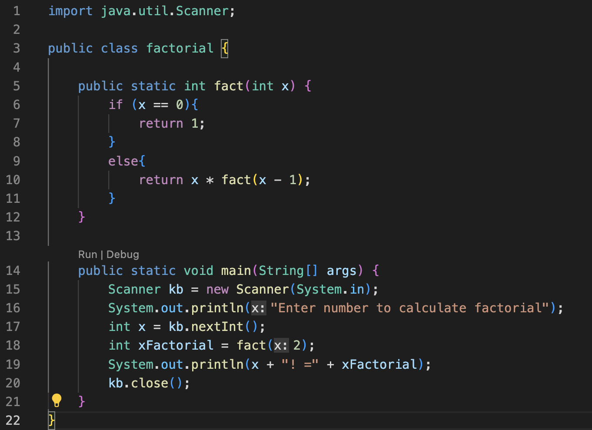
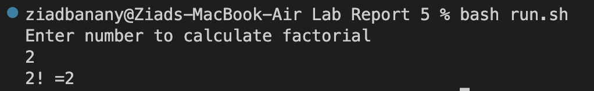

# Lab Report 5

## Part 1 – Debugging Scenario

1. EdStem Post 

**What environment are you using (computer, operating system, web browser, terminal/editor, and so on)**

I am using a MacBook on a MacOS and VSCode. 

**Detail the symptom you're seeing. Be specific; include both what you're seeing and what you expected to see instead. Screenshots are great, copy-pasted terminal output is also great. Avoid saying “it doesn't work”.**

Calculating the factorial of 2 should be returning "2! = 2". However, the program keeps crashing and indicating that there is an "Exception in thread "main" java.lang.StackOverflowError".

*Screenshot:*


**Detail the failure-inducing input and context. That might mean any or all of the command you're running, a test case, command-line arguments, working directory, even the last few commands you ran. Do your best to provide as much context as you can.**

Below is the code: 
*Screenshot*:


This is run via a bash script with the following contents:

``` 
javac factorial.java 
java factorial 
``` 

The output is indicating that the error is caused by line 6, which makes me believe that the calculation results in unexpected behavior. Considering that this is a StackOverflow Error, I am also guessing that this issue might have to do with memory or an infinite loop but I am unsure as to why my code is causing that. 


2. TA Response

Hello Ziad, thank you for your screenshot and for providing context for the bug. 

Calculating factorials is usually done through recursion. It seems as though you are definitely on the right track with the recursive case. However, it is useful to remember that recursive algorithms include both a base case and a recursive case. In your code, there doesn’t seem to be a base case. Think about how this would cause an infinite loop. If there is no base case, or a condition that stops the recursive calls, then that would definitely cause unexpected behaviors because then the recursive calls continues to call itself infinitely, and that is the most probable reason you are getting a StackOverflow Error (you were on the right track guessing that it was caused by an infinite loop!).

Consider adding a base case and remember that it should look something along the lines of:

``` 
if (base case) {
    return ___;
}

else{
    return ___;
}
``` 

Good luck!

3. Implementing TA Suggestion 

Upon receiving feedback from the TA, the code was changed to include a base case. The code thereafter looked like this:

*Screenshot*:


Upon running the bash script, the terminal output looked like this:

*Screenshot*:


Therefore, the bug was a logic error that caused an infinite loop. The calculation of the factorial never actually stopped (ie. there was no base case), therefore the recursive function called itself infinitely many times. Now, the recursive calls stop once n-1 is equal to 0, therefore the n is multiplied by n-1 and updated a correct amount of times. 

## Part 2 – Reflection

There are many things I learned from my lab experience in the second quarter. The one thing that I found the most interesting was learning different commands for bash when writing the autograde. This includes different operators such as “-ne” that allows you to check whether two variables are not equal. I also discovered different ways to complete operations faster by implementing other programing languages such as AWK into the bash scripts. For example, a line from my autograder reads:

``` 
score=$(awk -v testsP="$testsP")
``` 

This uses the AWK language and the -v option to assign a value to the variable that is then executed as part of a calculation of the score. It allowed me to do multiple steps in just one line. This was a cool addition that I discovered and was useful in my work. 


